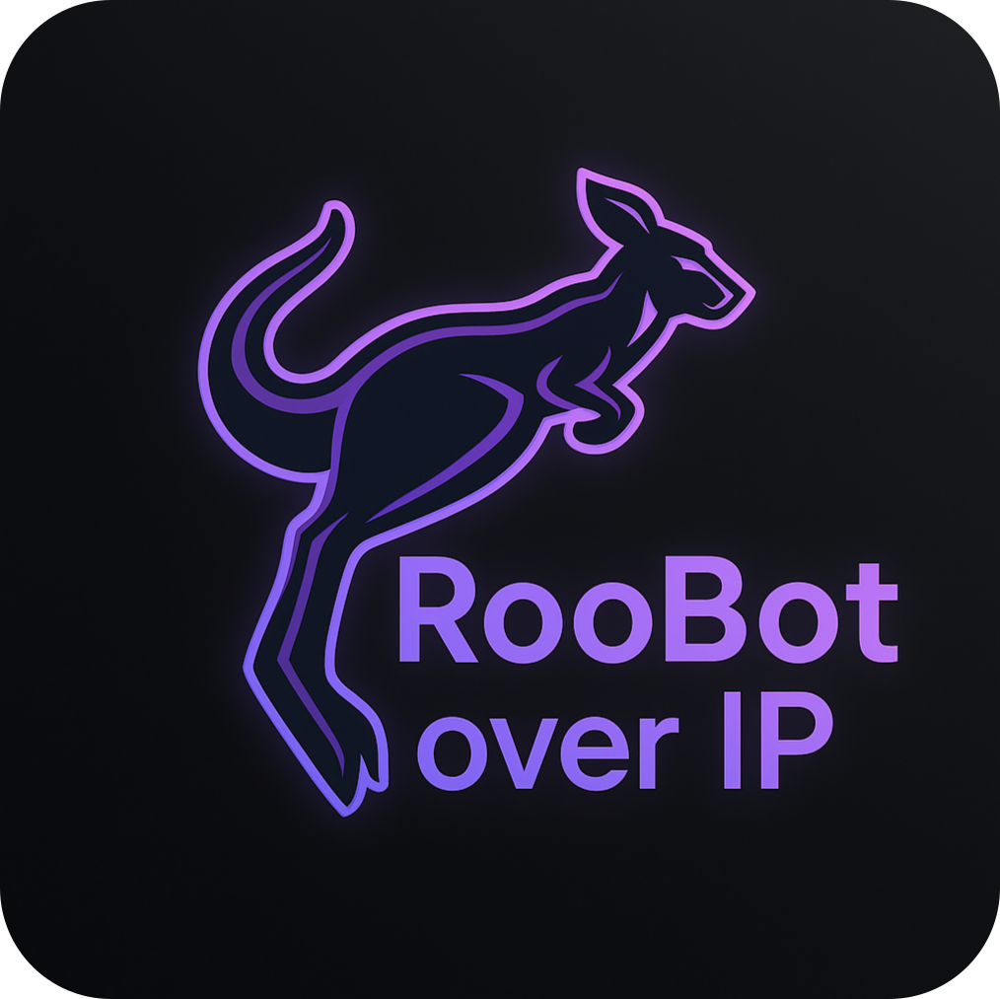

<h1> RooBot Over IP </h1>

Intranet based IO control system for robotics and wider applications.
Modular hardware and closed loop reliable communication over ethernet, including a standard internet connected network.

## Documentation Table of Contents

-   Getting started
    -   [Overview Explanation](docs/OverviewROI.md)
    -   [Programming](docs/ProgrammingROI.md)
-   Modules Reference
    -   [UDP API Reference](lib/UDP-API/OverviewReadme.md)
    -   [Module Infra Library](lib/moduleLib/ModuleReadme.md)
    -   [PlatformIO](Modules/Platformio.md)
-   ROS Controller Reference
    -   [ROS Package](ROS/README.md)
    -   [ROS Interfaces](ROS/InterfaceReadMe.md)
    -   [ROI ROS Package Integration](docs/Integration.md)

## Layout

### System Layout

Modules are individual units with various capabilities, they range from simple Arduino based GPIO to complex modules to handle sensors and communication.

Each is connected back to the network via ethernet or WIFI(WIP), and are POE capable.

The modules can be interacted with multiple controllers (any device on the network), but it's recommended to have a single controller, otherwise additional state management will be required.

### File Topology

-   lib (ROI Library files needed by every part of the project)
    -   moduleLib (ROI Library files used by modules only)
-   Modules (Module hardware and main src files)
-   ROS (ROS package)

## Communication

### UDP Communication

UDP is used for most communications; most traffic follows a command and response pattern, with the controller sending a command and the module responding with a response. If no coherent response is received, the controller will resend the command.

The UDP packets are sent on different ports that support different structures, but all are variable length. General packets, used to configure, read, write, or update the module are sent on port 57344, `ROICONSTANTS::ROI_GENERAL_PORT`, and are structured as follows:

A 16-bit subDeviceID is used to identify the module subsystem, a GPIO pin for example, and a 16-bit action code is used to identify the action to be taken on the subsystem. Finally, a data payload is included, which can be of variable length up to `ROICONSTANTS::MAXPACKETPAYLOAD`.

sysAdmin packets are sent on port 57664, `ROICONSTANTS::ROI_SYS_ADMIN_PORT`, and are used to manage the module and network. They can be used to ping, generate a status report, or configure other setting of the module. All modules will support all sysAdmin packets, whereas general packets are module specific. The structure of a sysAdmin packet is as follows:

The packet has an additional 16-bit metadata field, which is used to set [chain parameters](#neighbor-chain), such as whether a packet should be forwarded to the next module in the chain, and where replies should be sent. The origin octet is used to identify the module that started the chain, and the forwarding stops when the packet reaches the origin module. The sysAdmin packets have an action code used to specify the action to be taken, and a data payload that can be used to pass additional information.

### TCP Communication

TCP is used for interrupt signals from modules, as it creates a reliable stream where interrupts can be sent without response or worry of lost packets. Currently interrupts are work-in-progress, but the plan is to have them sent on port 57600, `ROICONSTANTS::ROIINTERRUPTPORT`.

## Neighbor Chain

ROI modules are made to be connected on a network with non-ROI devices and have dynamic IP configuration(WIP), and because of this sending packets to all devices is more difficult. To solve this each module is tasked with finding it's closes ROI neighbor and forwarding packets to it when appropriate. As each module finds it's neighbor, a chain will be formed where each module forwards a packet to the next and to the next, reaching all of the devices. This chain is dynamic and will handle hot-plug of modules into and out of the network.

## Project Proposal Presentation

<object data="docs/Roobot-Over-IP.pdf" type="application/pdf" width="700px" height="700px">
    <embed src="docs/Roobot-Over-IP.pdf">
        
This browser does not support PDFs. Please download the PDF to view it: <a href="docs/Roobot-Over-IP.pdf">Download PDF</a>.

    </embed>
</object>

This is a project proposal presentation that was given to the team. It outlines the project and the goals of the project.

## Installation

This repo is intended to be built into your code as a submodule to the repository. Barring that, just clone the repository into a `Roobot-Over-IP` folder in your ros workspace. Through the power of recursive search colon build will find the ROI ros package and build it.

Following our best practice in your repository root for installing the ROI submodule:

1. `mkdir external`
2. `git submodule add https://github.com/UA-NASA-Robotics/Roobot-Over-IP external/Roobot-Over-IP`
3. `git submodule update --init --recursive`

We use `control_msgs` as ros interfaces, so you will need to call git submodule update --init --recursive in the `external/Roobot-Over-IP/ROS` folder to get the control_msgs package even if you don't use ROI as a submodule.

### Personal Setup

If you are setting up a system for developing ROI or using it, there are some additional steps to make work easy in vs-code.

1. Install the [PlatformIO](https://platformio.org/) extension for VSCode. (If working on embedded firmware)
2. If on windows, use our `docs/dev-tools/docker-compose.yml` file to set up a dev environment. This will port-forward ROI ports to your host machine, so you can use the dev environment to test modules and the ROI library. You can also use the dev environment to build the ROI library and modules. (WIP, may not work)
3. Setup cpp extension environment. Make a `.vscode` folder in the root of the repository and copy `docs/dev-tools/c_cpp_properties.json` into it. This will set up the include paths for the ROI library and modules allowing intellisense to work properly.
