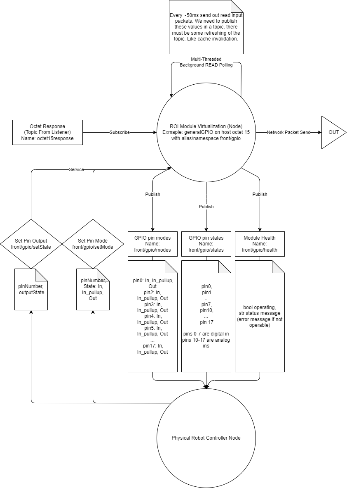

# ROS Integration

## Overview

## Folder Structure

### lib

ROI interface code (Autogenerated)

### libs

Libraries used by the ROI ROS interface

## ROS Interfaces

### Topics

### Services

### Actions

### Parameters
