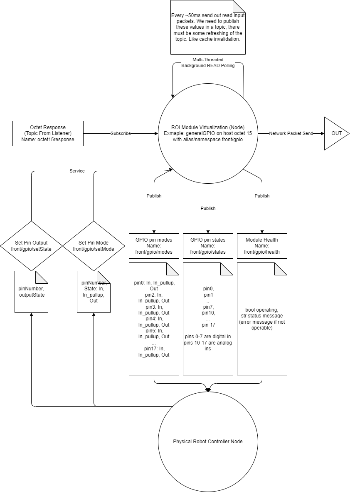

# ROS Integration

The ROS package portion of ROI acts as the interface into the ROS universe. Each module gets a corresponding ROS node which acts as a digital twin. The node provides convenient ROS interfaces for your external application to affect the ROI system, making it transparent to your project.

## Overview

An example of the ROS node structure for the ROI system implementing 1 GeneralGPIO module. (Packet IO shown are to/from transportAgent)

## Transport Agent

Note that while each module has a corresponding node, there is also a transportAgent node required to be operating. The reason for this is a limitation of the UDP socket. Only one program can bind to a specific port, and so the transportAgent does so, passing UDP packets to the correct ROS NODE via topics. It acts as an intermediary layer, pulling the network logic out of each module ros node. (It also helps sockets are much easier to implement in python as compared to c++)

Only 1 transportAgent needs to be spun up for any amount of ROI modules.

-   [Integrating ROI in a Project](docs/Integration.md)
-   [Developing for ROI](docs/ProgrammingROI.md)
    
See above for more details.

## ROS Package References

-   [ROS External Interfaces Reference](ROS/interface/InterfaceReadMe.md)
-   [UDP API Reference](lib/UDP-API/OverviewReadme.md)
