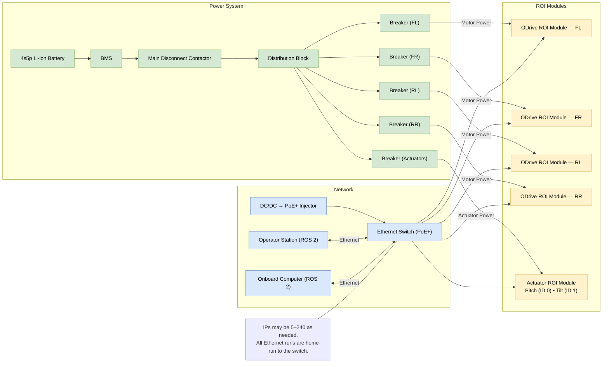
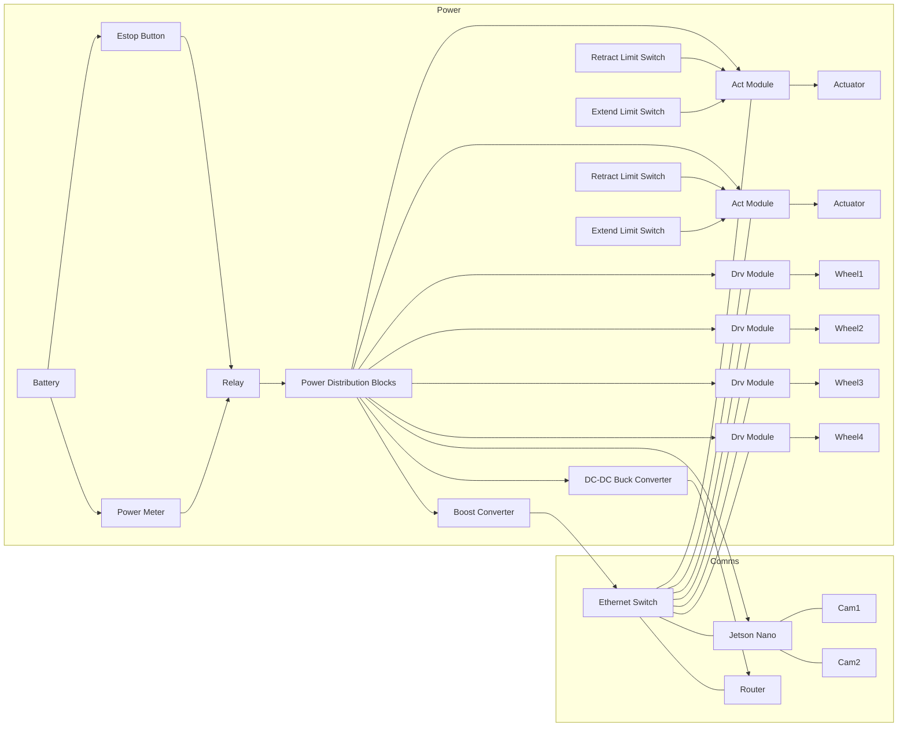

# Front Loader ROI Diagrams (Mermaid)

These diagrams render directly on GitHub and in VS Code (with a Mermaid extension). They mirror the draw.io content but with cleaner layout and diff-friendly text.

## Hardware overview

## Data flow

